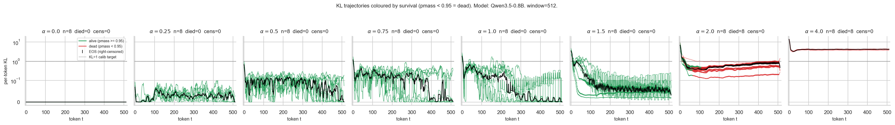
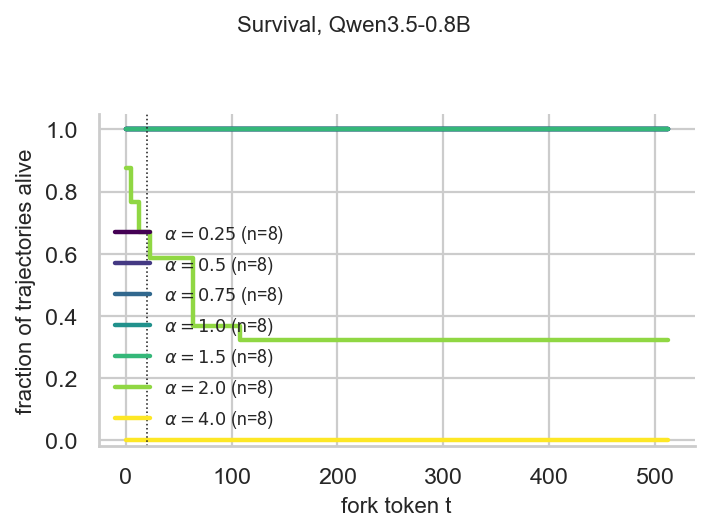

# iso-kl-figure

How strongly should we steer a model? How do we compare steering methods when one might be strong and one weak? These are calibration questions.

Treat steering as an intervention: we want maximum behavior change with minimum side effects, like incoherence, format collapse, or random off-target damage.

A useful analogy is a car on the road. A small nudge to the steering wheel gets corrected by the driver. A larger nudge causes a lane change. A very large nudge causes a crash the driver cannot recover from. Some crashes happen immediately. Some take a few seconds to develop, after the driver tries and fails to correct.

We measure the distribution shift caused by steering, especially the worst 5% of per-token KL that would cause a "crash", and find the largest scalar coefficient C that keeps that 5% below a safe threshold (default: 1 nat). At `alpha = 1` the steering is delivering exactly that calibrated dose. At `alpha = 2` it is doing twice the dose. *Iso-KL* means: comparing two methods at the same alpha = 1 means they are spending the same per-token KL budget, so any behavioural difference is not just one of them being louder.

Then comes the survival question. If the calibration only looked at the first w tokens of the rollout, do crashes still happen later? Most trajectories either stabilize or go off track within the first 50-100 tokens, but we want to see the long tail too. So at every fork t we ask: can the model still produce one of two valid answer tokens (`true` or `false`) when forced into a JSON-schema prefill? If yes, *alive* at t. If the probability mass on those tokens drops below 0.95, *dead*, and dead stays dead. Survival S(t) is the fraction still alive at token t, with right-censoring for rollouts that hit EOS before t.

Headline result on Qwen3.5-0.8B (`mean_diff`, w=512, n=8 held-out prompts):

- `alpha` in {0, 0.25, 0.5, 0.75, 1.0, 1.5}: 0 of 8 trajectories die at any fork.
- `alpha = 2.0`: 8 of 8 die. Median death time t = 64.
- `alpha = 4.0`: 8 of 8 die at t = 0.

A phase transition at roughly 2x the iso-KL coefficient. The calibrated dose has long-horizon headroom; doubling the dose is a slow crash; quadrupling it is an instant one. Figures and table below.


## Spaghetti: per-token KL trajectories, coloured by survival



*Per-token KL(steered || base) for n=8 held-out long-form prompts on Qwen3.5-0.8B (mean_diff, w=512). One panel per alpha. Each thin line is one trajectory; green = alive at that token (pmass_eval >= 0.95), red = dead. Black line is the median. Dotted horizontal: KL = 1 nat (the calibration target).*

How to read this plot, in order:

1. *alpha = 0.* KL is exactly zero everywhere. This is the base model; nothing has been added. A sanity check that the splicing pipeline does not itself perturb the logits.
2. *alpha = 0.25 to 1.0.* KL stays well below the 1-nat line for most tokens. The calibration window only required p95 = 1 nat, so most tokens are far below. All trajectories are green: the model is still producing schema-valid answers throughout. The "warm but not hot" zone.
3. *alpha = 1.5.* KL still mostly below 1 nat but with a fatter upper envelope. All trajectories still alive end-to-end on the held-out set, even though calibration only guaranteed survival up to roughly `alpha = 1`. Suggests headroom.
4. *alpha = 2.0.* KL median sits around 1 nat for most of the rollout, with a noisy plateau. The trajectories turn red part-way through. Steering is now strong enough to break format. The phase transition.
5. *alpha = 4.0.* Every trajectory is red from t = 0 and KL is roughly 4-6 nats throughout. The model is no longer answering the question; it is generating something else.

The diagnostic shape is the alpha = 2 panel: KL is only modestly above the calibration target (less than 2x in nats) but format collapse is total. KL is necessary but not sufficient as a steering budget. Going from "calibrated" to "calibrated x 2" is not a smooth degradation; it crosses a cliff.

## Survival: when do trajectories die?



*Kaplan-Meier S(t) on the pmass_eval death event (pmass_eval < 0.95). One curve per alpha, n = 8 trajectories each. Dotted vertical: t = 20, the upper end of the calibration window's relevance for the answer span; everything to the right is generalization.*

| alpha | n | died | censored | S(mid) | S(end) | t at S<=0.5 |
|------:|--:|-----:|---------:|-------:|-------:|------------:|
|  0.00 | 8 |    0 |        0 |  1.000 |  1.000 |          -- |
|  0.25 | 8 |    0 |        0 |  1.000 |  1.000 |          -- |
|  0.50 | 8 |    0 |        0 |  1.000 |  1.000 |          -- |
|  0.75 | 8 |    0 |        0 |  1.000 |  1.000 |          -- |
|  1.00 | 8 |    0 |        0 |  1.000 |  1.000 |          -- |
|  1.50 | 8 |    0 |        0 |  1.000 |  1.000 |          -- |
|  2.00 | 8 |    8 |        0 |  0.586 |  0.321 |          64 |
|  4.00 | 8 |    8 |        0 |  0.000 |  0.000 |           0 |

How to read this table, in order:

1. *Censored is always 0* here, so survival numbers are not biased by short rollouts. Every trajectory reaches every fork t in `{0, 5, ..., w}`.
2. *alpha 0 to 1.5*: `died = 0`, `S = 1.0` everywhere. Format holds for the full rollout. The held-out set generalizes past the calibration window (t = 20 dotted line) all the way to t = 512. The 1-nat KL budget set on calibration prompts continues to be a survivable budget on a different prompt set, more than an order of magnitude past where calibration looked.
3. *alpha = 2.0*: `died = 8` of 8 within the rollout; median death at t = 64. All trajectories eventually break, but they survive the first 64 tokens, about 3x the calibration window. Format collapse is gradual at this dose.
4. *alpha = 4.0*: median death at t = 0. The first fork already shows `pmass_eval < 0.95`. Format collapse is immediate.
5. *Read t at S<=0.5 as a half-life.* It scales nonlinearly with alpha: 64 tokens at 2x, 0 tokens at 4x. Doubling the dose past the calibration point does not double the half-life; it eliminates it.

The calibrated alpha (`alpha = 1`) earns a high-confidence survival claim within this experiment: 8 of 8 trajectories survived all 512 forks on a held-out prompt set. Doubling the dose still leaves a usable window. Quadrupling it does not.

## Reproduce

```bash
uv sync --extra all
just smoke         # tiny-random model, ~1 min CPU
just calibrate     # one (model, method, seed, window) cell
just trajectory
just plot
```

The headline run for the figures here:

```bash
uv run --extra all python scripts/run_cell.py \
  --model Qwen/Qwen3.5-0.8B --method mean_diff --seed 0 --window 512 \
  --out-root outputs/qwen35_w512_dense \
  --run-id Qwen3.5-0.8B_mean_diff_s0_w512_dense \
  --compute-pmass --skip-pmass-qa --fork-log \
  --alphas 0.0 0.25 0.5 0.75 1.0 1.5 2.0 4.0 \
  --render-figs --render-threshold 0.95
```

Outputs land under `outputs/qwen35_w512_dense/<run-id>/figs_auto/{survival,spaghetti,aggregate}/`.

## What this repo is and isn't

In scope:
- One figure family (spaghetti, survival, aggregate) and one calibration script.
- 3 methods: `mean_diff`, `directional_ablation`, `pca`.
- A `branch_pmass` metric: fork-and-teacher-force probability mass on a forced-choice answer token after schema prefill.

Out of scope:
- A method zoo beyond those three.
- A norm-matching baseline. Iso-KL says nothing about whether two methods of equal KL move the same distance in activation space.
- A threshold sweep. The pmass < 0.95 cutoff is a single point; neighbours might disagree.

## Honest caveats

- *Iso-KL is one fairness criterion, not the criterion.* Matching p95 per-token KL means matching distributional disagreement under greedy decoding in the calibration window. It does not match intervention norm, behavioural effect size, or human-perceived quality.
- *Pmass is a proxy.* It scores whether the model still produces one of two specific tokens after we splice in a schema. A model that has gone off-format but is otherwise coherent gets scored as dead.
- *n = 8.* Held-out prompts, not held-out seeds. The phase-transition shape is consistent at this scale; the exact half-life at alpha = 2 is not.
- *One model so far.* Gemma 4B, Gemma 12B (4-bit), OLMo-2 1B, and OLMo-3 7B at w = 4096 are queued. The phase-transition story may or may not survive scaling.


## Glossary

Operational definitions used in this repo, not textbook ones. Skim and come back as needed.

- *steering coefficient (alpha)*: scalar multiplier on the steering vector added to residual-stream activations at one layer. `alpha = 1.0` is the iso-KL-calibrated coefficient C. `alpha = 0` is the unsteered base model.
- *iso-KL calibration*: bisection on alpha such that the 95th-percentile per-token `KL(steered || base)` over a w-token calibration window equals 1 nat. Output is `c_star`, the coefficient at `alpha = 1`.
- *p95 KL*: 95th percentile of per-token `KL(steered || base)` over the calibration window. The "worst 5%" measure used by calibration.
- *window (w)*: length in tokens of the calibration rollout. `w = 512` for the figures here.
- *pmass*: probability the model puts on the set `{true, false}` after we splice in a JSON schema prefill (`'\nI should answer now.</think>{"value": '`) at fork token t.
- *pmass_eval*: pmass on a held-out prompt set, at every fork t.
- *fork point t*: the token in the rollout where we splice the schema and read pmass.
- *death*: irreversible. Alive at t means `pmass_eval(t) >= 0.95`. First time it drops below, dead, and stays dead. Below 0.95 the JSON schema stops being a stable attractor.
- *right-censoring*: the rollout hit EOS at length L < t, so we never see fork t. Drops out of the at-risk denominator from L onward; not death.
- *survival S(t)*: Kaplan-Meier estimator of the fraction alive at fork t.
- *mean_diff*: steering vector built as the difference of mean activations on a contrastive prompt pair.
- *spaghetti plot*: every individual KL trajectory drawn as one thin line, alive segments green, dead red, black line is the median.