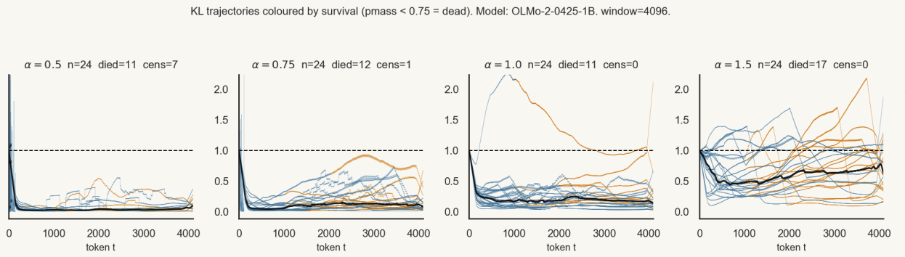
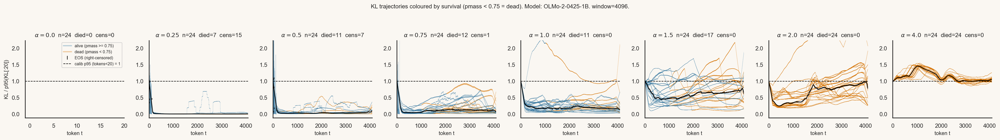

# calibrating steering overl ong trajectories by normalising KL outliers



## The problem

Activation steering has a knob. You pick a steering direction, multiply
it by a coefficient, and add the result into one residual stream. Small
coefficient: nothing happens. Large coefficient: the model breaks.
Somewhere in between is what you want.

Most papers either pick one coefficient per method, or sweep coefficients
without normalising across methods. So when they say "method A is better
than method B" what you actually learn is "whoever turned A's knob got
more careful tuning than B's."

I want to compare methods more fairly. The natural way is to spend the
same "intervention budget" across methods, then ask what the budget bought
you in behaviour.

## The attempt: iso-KL calibration

Pick the budget as a per-token KL divergence between the steered and base
distributions. Concretely:

1. Run the steered model on a calibration prompt for w tokens.
2. Compute per-token `KL(steered || base)`.
3. Bisect on the coefficient until the 95th percentile of those KLs equals
   1 nat. Call the result `c_star`.
4. Define `alpha = 1` to mean "you are spending the calibrated budget."
   `alpha = 2` is twice the dose, etc.

So at alpha = 1, two methods are spending the same per-token KL. Any
behavioural difference between them is not just one of them being louder.

Then sweep alpha from 0 to 4 and look at what happens.

## Alive vs dead

Before showing the figure, one more piece. KL tells you how much the
distribution moved, but not whether the model still works. So I track a
separate signal: can the model still answer a yes/no question?

At every fork token along the rollout I splice in a JSON schema prefill
(`'\nI should answer now.</think>{"value": '`) and check whether the
steered model puts probability mass `>= 0.75` on one of `{true, false}`.
If yes, the model is coherent enough at that point to commit to a
boolean answer: *alive*. If no, it can't even pick between true and
false when handed the schema on a plate: *dead*. Once dead, dead stays
dead. So "dead" is shorthand for "the model is no longer coherent enough
to answer the question, and isn't coming back."

## The figure

OLMo-2 1B, mean-diff steering, w = 4096 calibration window, n = 24
held-out prompts (different prompts than calibration saw). One panel per
alpha.

Y-axis is per-token KL divided by each trajectory's *own* p95 over the
first 20 tokens, so the dashed line at y = 1 is the calibration scale by
construction. Anything above 1 means the trajectory is over its own
early-rollout budget. Blue = alive, orange = dead, black ticks = EOS
(rollout finished naturally before the window ended).



How to read the panels, in order:

- **alpha = 0.** No steering. KL is exactly zero, denominator is zero, all
  trajectories are skipped. Empty panel is the correct outcome.
- **alpha = 0.25 to 0.75.** Median KL sits well below 1 for the whole
  rollout. The 1-nat budget set on a w = 4096 calibration window has long-
  horizon headroom on a different prompt set.
- **alpha = 1.0.** Median hovers a bit under 1, with one outlier above 2.
  Iso-KL is roughly delivering its claimed dose.
- **alpha = 1.5 to 2.0.** Median crosses 1 and stays there. Most
  trajectories die. KL is sustainably over budget.
- **alpha = 4.0.** Everyone dies, fast.

## What works, what doesn't

It kind of works. Doubling the calibrated dose is a slow crash. Quadrupling
it is instant. The shape of the alpha sweep matches what calibration
predicts.

It also doesn't work, in interesting ways:

- **Random dead traces at low alpha.** At alpha = 0.25 to 0.75, KL stays
  comfortably under the calibration scale and yet 7 to 12 of 24
  trajectories die at some fork. They are not dying because the budget
  was exceeded; they are dying for some other reason that p95 KL doesn't
  see. Possibilities: a single high-KL spike at one token that p95
  averages away; a low-KL but format-fragile region where small logit
  shifts knock pmass below threshold; pmass at 0.75 just being noisy.
  Probably some of each. So p95 KL is necessary but not sufficient as a
  steering budget.
- **It doesn't calibrate cleanly across methods.** It works fine for
  `mean_diff`. For more directional methods (e.g. directional ablation,
  PCA) the same KL budget at alpha = 1 produces noticeably different
  behavioural effects, because mean-mass shifts and directional
  projections have different geometry, and one scalar KL doesn't
  distinguish them.

The second point is probably unavoidable for any single scalar
calibration target. The intervention is multi-dimensional, the target is
one number.

## Extended result: iterated steering and a coherence budget

Iso-KL calibration has a natural application to *iterated* steering, where
you repeat the extract → calibrate → apply cycle multiple times, each round
building on the previous intervention.

The setup (Qwen3-4B, Care↑ vs Authority↑ persona, mean-diff steering,
[steering-lite](https://github.com/wassname/steering-lite)):

- Round 0: extract mean-diff direction from base model, bisect on
  coefficient until **p95 per-token KL = target**, apply, evaluate.
- Round r: re-extract from the already-steered model, re-calibrate to
  the same p95 KL target, apply on top of all prior rounds, evaluate.

Each round spends the same p95 KL dose. The question is how many rounds
you can do before incoherence overwhelms the steering signal.

**The finding:** the model has a fixed coherence budget of roughly
**1.7 nats total cumulative KL** (across all rounds). Once that budget is
spent, the model breaks down — the Social Norms logit jumps from its
steered floor to positive, and forced-choice accuracy collapses. This
constant is the same regardless of how you slice the budget across rounds
or which method you use.

Here is what the axis shift looks like for KL=0.10 (20 rounds, Qwen3-4B,
Care↑ vs Authority↑; values are mean logit advantage of each foundation in
a 7-way forced-choice):

```
r    Care   Auth   SocN   margin  note
0   -3.29  -3.84  -6.19  +10.79  baseline (no steering)
1   -3.15  -4.02  -6.18  +11.26
4   -2.80  -4.41  -6.34  +12.01
8   -1.70  -4.95  -6.54  +12.01
10  +0.41  -5.31  -6.66  +10.92  Care crosses zero
14  +4.18  -6.61  -5.99   +6.00  Auth near floor, SocN slipping
15  +3.00  -6.81  -4.12   +3.58  SocN creeping
17  -0.67  -6.91  +0.61   +0.77  BREAKDOWN: SocN-jump
```

Auth (the suppressed axis) descends steadily to its floor regardless of
pace. Care (the amplified axis) rises, then collapses at breakdown when
incoherence dominates. SocN (Social Norms) staying negative is the
coherence sentinel; once it goes positive the model is no longer reliably
using its value structure to answer questions.

| KL/round | breakdown round | cumul. KL | Care (last healthy) | Auth (last healthy) |
|----------|----------------|-----------|--------------------|--------------------|
| 0.30     | r=6            | 1.8 nats  | +4.78              | -6.60              |
| 0.20     | r=9            | 1.8 nats  | +4.42              | -6.58              |
| 0.15     | r=11           | 1.7 nats  | +4.22              | -6.60              |
| 0.10     | r=17           | 1.7 nats  | +4.18              | -6.61              |
| 0.05     | r=36           | 1.8 nats  | +3.88              | -6.65              |

The last two columns are what matters: the total axis shift at the final
usable round is nearly identical regardless of how many installments it
took. You always arrive at roughly the same place (Care ≈ +4.4, Auth ≈
-6.6) — the budget determines the destination, not the pace.

This means iso-KL calibration is doing something real: the p95 KL target
per round measures against a model-intrinsic limit. Set it too high and
you spend the budget in 2-3 rounds. Set it low and you get more
intermediate checkpoints — useful if you need to track the trajectory
or interleave other evaluations — but the total intervention is the same.

The law is method-agnostic across the two linear activation-addition
variants tested: super_sspace and mean_diff give identical breakdown rounds
at the same KL/round target. super_sspace is 3.4× slower per round with no
behavioural benefit.

**Caveat: this is specific to linear activation addition.** The constant
budget result is plausibly a property of *additive* residual-stream
interventions, where each round stacks a new direction vector on top. A
technique with a different intervention geometry — e.g. contrastive
decoding, finetuning, or a nonlinear gating method — would not necessarily
spend the same per-token KL budget for the same behavioural shift, and
the budget-is-constant conclusion might not transfer. The rule here is
specifically: *for linear additive steering, the model's tolerance to
cumulative distribution shift is ~1.7 nats regardless of dose schedule.*

## So is it useful?

Probably yes, weakly. The calibration this gives you does enable a
fair-er method comparison. I've used it in
[steering-lite](https://github.com/wassname/steering-lite) for a sweep
across four methods, where the iso-KL coefficient is what makes the
comparison not just a lottery on whose default coefficient was tuned
harder.

Better directions if anyone wants to improve this:

- A different lens on steering strength. Taimeskhanov, Vaiter, & Garreau
  (2026), [Towards Understanding Steering
  Strength](https://arxiv.org/abs/2602.02712), derive how steering
  magnitude affects next-token probability and cross-entropy across 11
  models, and report non-monotonic effects of strength. They look at the
  immediate next-token effect rather than stability along a trajectory,
  so it's a complementary view, not a replacement: theirs answers "what
  does cranking the knob do at one token", mine asks "does the model
  stay coherent for 4k tokens at a calibrated dose". Worth combining.
- Per-token cosine gating. Some steering methods scale the intervention
  by the cosine between the residual and the steering direction, a cheap
  way to suppress the intervention where it doesn't apply. (I forget who
  first did this; pointers welcome.)
- A different calibration target. p95 KL is what I used because it is
  cheap and intuitive; a behavioural target (e.g. preserve base
  perplexity on a held-out corpus within delta) might be more honest
  about what we actually care about.
- Accept that mean-mass shift is a coarse intervention and stop trying to
  calibrate it past a certain precision. Use the calibration to put
  methods in the same order of magnitude, then compare on downstream
  behaviour.

Mostly I'm sharing this because the alternative in much of the literature
is "no calibration." This is cheap, fast, and strictly better than that.
I hope someone improves on it.

## Reproduce

```bash
uv sync --extra all
uv run --extra all python scripts/run_cell.py \
  --model allenai/OLMo-2-0425-1B --method mean_diff --seed 0 --window 4096 \
  --out-root outputs/olmo1b_w4096_dense
uv run --extra all python scripts/spaghetti_kl_alive.py \
  --runs-root outputs/olmo1b_w4096_dense/_OLMo-2-0425-1B_mean_diff_s0_w4096_dense_n24_single \
  --out figs/spaghetti_olmo2_1b_w4096_norm \
  --window 4096 --threshold 0.75 --model-contains OLMo-2-0425-1B \
  --roll 301 --line-lw 0.4
```

See [README_long.md](README_long.md) for the long version with the original Qwen run,
glossary, and survival analysis.
